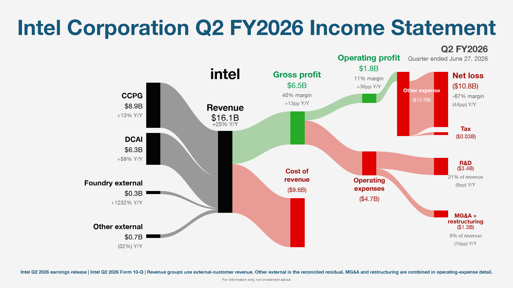

# Income Statement Sankey Skill

## 中文说明

这是一个面向 Codex 及兼容 Agent 的财报收入利润桑基图 Skill。它会优先读取
公司投资者关系网站、财报新闻稿和监管文件，核验收入组成、同比变化、毛利、
营业利润、税项、其他收入/费用和净利润，再生成固定为 `2000x1122` 的 PNG。

主要能力：

- 支持盈利与亏损财报，负净利润会显示为红色 `Net loss` 流程。
- 支持普通产品/服务公司，以及 `layout.style: "conglomerate"` 的综合集团布局。
- 对收入、毛利、营业利润、税前利润和净利润执行严格勾稽校验。
- 将明细管道限制在所属父桶范围内，避免小额 Tax、COGS 或费用流发生偏移、
  断开或越界。
- 数据源必须来自公司官方披露或监管文件；聚合站只能用于辅助交叉检查。

安装：

```bash
git clone https://github.com/feiyuggg/income-statement-sankey-skill.git
mkdir -p ~/.codex/skills
ln -s "$PWD/income-statement-sankey-skill/income-statement-sankey" \
  ~/.codex/skills/income-statement-sankey
```

典型指令：

```text
给我一份英特尔最新季度财报收入图
分析苹果收入组成和占比，生成财报桑基图
```

校验和生成：

```bash
python3 income-statement-sankey/scripts/build_batch.py DATA.json \
  --out-dir OUTPUT_DIR
```

批量生成时可以一次传入多个 JSON，脚本会先统一校验，再并行渲染，并用内容哈希
缓存跳过没有变化的图。这样不会在每张图上重复加载 `yfinance/pandas` 或反复解析
依赖：

```bash
python3 income-statement-sankey/scripts/build_batch.py data/*.json \
  --out-dir output --jobs 5
```

如果本机 Python 尚未安装 `matplotlib` 和 `Pillow`，将 `python3` 替换为
`uv run` 即可。`fetch_income.py` 仍单独保留 `yfinance`，只用于辅助交叉核验。

### 生成效果参考

下面是仓库内 Intel Q2 FY2026 亏损场景的确定性回归图：



- 在线展示参考：`https://stock.gochatagent.com/`
- 该站点仅作为图表展示和版式参考，不是本 Skill 的官方财务数据源。
- 实际生成时仍须打开并核验公司 IR 或监管披露，不得从参考站点直接推断财务数据。

## English Overview

A Codex skill that retrieves official earnings data, analyzes revenue mix and
profit structure, validates the numbers, and renders a deterministic
`2000x1122` income-statement Sankey PNG.

The default renderer supports both net income and net loss, including small
tax values, multi-group revenue labels, long operating-expense names, and
bounded detail flows that cannot extend beyond their parent nodes.

The chart includes:

- Company-reported revenue groups and their revenue shares
- Optional product/category segments
- Revenue, gross profit, cost of revenue, operating expenses, operating income,
  tax, other income, and net income
- Recomputed year-over-year growth and margin changes
- Source labels from company investor relations or regulatory filings

Two layouts are available:

- **Default** — product/service companies. Revenue groups and optional segments
  on the left, then gross profit, operating profit, and net profit.
- **Conglomerate** (`layout.style: "conglomerate"`) — insurers, banks, and
  holding companies. Reported business segments each carry their own margin,
  revenue splits straight into operating profit and operating costs with no
  invented gross-profit line, and operating profit plus investment gains feed a
  pre-tax node. Segment profits must reconcile to operating profit.
  Example: `income-statement-sankey/scripts/examples/brk_q2_2026_conglomerate.json`.

## Install

Clone the repository and link the skill into your Codex skills directory:

```bash
git clone https://github.com/feiyuggg/income-statement-sankey-skill.git
mkdir -p ~/.codex/skills
ln -s "$PWD/income-statement-sankey-skill/income-statement-sankey" \
  ~/.codex/skills/income-statement-sankey
```

Restart Codex after installation.

## Use

Typical prompts:

```text
给我一份苹果最新季度财报收入图
分析微软收入组成和占比，生成财报桑基图
Create an income statement Sankey for the latest reported quarter of GOOGL
```

The skill directs Codex to:

1. Resolve the exact reporting period and publication date.
2. Open official investor-relations or regulatory documents.
3. Extract current and same-period-prior-year values.
4. Recompute revenue shares, YoY growth, and margin changes.
5. Reconcile the income statement under a tight tolerance.
6. Render and visually inspect the PNG before delivery.

## Validate And Render

```bash
python3 income-statement-sankey/scripts/build_batch.py DATA.json \
  --out-dir OUTPUT_DIR
```

Render the bundled verified example:

```bash
python3 income-statement-sankey/scripts/build_batch.py \
  income-statement-sankey/scripts/examples/aapl_q3_fy26_full.json \
  --out-dir /tmp/income-sankey-render
```

For several verified periods, pass all JSON files in one command and set
`--jobs` to the desired parallelism. The generated `.sankey-cache.json`
sidecars prevent unchanged charts from being rendered again.

## Data Integrity

Yahoo Finance support is included only as a secondary core-P&L cross-check.
Strict validation requires an official or regulatory source record, complete
revenue composition, core income-statement identities, and prior-period values
that independently reproduce the displayed YoY metrics.

URL metadata checks reduce obvious source spoofing but cannot prove document
contents. The agent must open and inspect each official source before using it.

## Assets And Trademarks

The repository includes the complete visual material bundle used to reproduce
the example:

- `assets/reference-layout.jpg`: the original layout reference
- `assets/reference-output.png`: the renderer's verified output
- `assets/intc-q2-fy2026-net-loss.png`: the verified Intel net-loss regression
  output
- `assets/apple-touch-icon.png`: an optional Apple brand asset

The original layout reference, company logo, company names, and trademarks are
third-party material and are not licensed under this repository's MIT License.
See `THIRD_PARTY_NOTICES.md` before redistributing or publishing derived work.
For other companies, add a logo only when it is user-supplied or obtained from
an official source with appropriate permission; otherwise the renderer uses
text.
